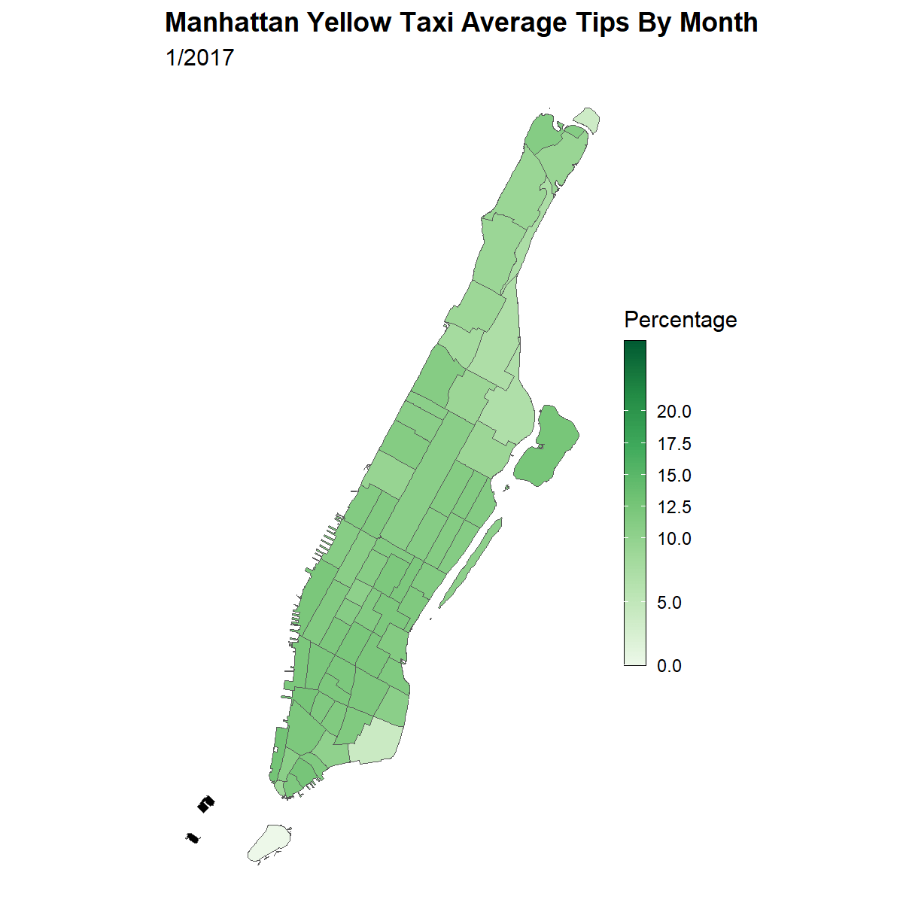

```{r setup, include=FALSE}
knitr::opts_chunk$set(echo = TRUE)
```

## Introduction

The question we wish to answer is **whether different New York City neighborhoods differ significantly from each other in tipping percentage.** To answer this question, we computed and compared the average tipping percentages on different pick-up locations and see how the tip amount varies by time. Our dataset exists on Kaggle as the New York Yellow Taxi dataset, but we sourced it directly from GitHub, where we found additional months of data. The data contain a file for each month with pick-up and drop-off times, pick-up and drop-off locations, fare amount and tip amount. Our shell script downloads the data separately by month, wrote a .sub file to clean and process the data in parallel on the CHTC, with each node given a month of data, and finished by writing an .Rmd file to finish our analysis and create our visualizations. We found little variation in tipping percentage by neighborhood over time, however higher concentrations did generally exist below central park than above it.

## Data Description / Manipulation

The dataset contains information on every taxi trip to occur in New York City between 2005 and 2021. The data are contained in a different csv for each month within that time frame. Early on, we ran into issues with downloading all of the data as one big file, so we found another website with the same data as well as more data for other years. For our spatial analysis, our computation was initially going to rely on the exact latitude and longitude of a trip’s pick-up or drop-off point. Through a bit of data observation, we found that files from later years did not contain this information, and that we would have had to bin these coordinates into neighborhoods, a challenging task. Luckily, for all years after 2017, the data files contained a different variable, `LocationID`, which categorized the location into different neighborhoods. Due to latitude and longitude shape files being difficult to work with, we took the ID value to simplify our computation, joining it with another dataset of NYC neighborhood shape files, which were compatible with our data. This is how we were able to graph our tipping and frequency values on a map. 

<br/><br/>

```{r, echo=FALSE, out.width="70%", fig.cap="\\textcolor{red}{Higher tipping percentages on wealtier regions}", fig.align = 'center'}

```

<br/><br/>

## Conclusion

Although the animation above shows little variability in tipping percentages over time within neighborhoods, we can see a slight favoring of southern Manhattan regions. Battery Park City and Hudson Square, along with West Village and Union Square boast the highest tipping percentages averaged over our time frame. These neighborhoods are all located near the Financial District, in wealthier neighborhoods. Harlem and other northern Manhattan neighborhoods boast lower tipping percentages. These neighborhoods are also far less attractive to wealthier riders, which we posit to be the most influential factor in our analysis. Another point of interest depicted by this map is the invariability of tipping percentages within geometries over time. This is further evidence for our hypothesis that tipping is strongly influenced by both social expectations and disposable income; riders in richer neighborhoods are both expected to and more able to consistently tip better than those in less affluent neighborhoods.

## Link to Github Repository

https://github.com/robiscuits/taxies
