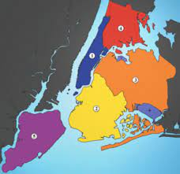
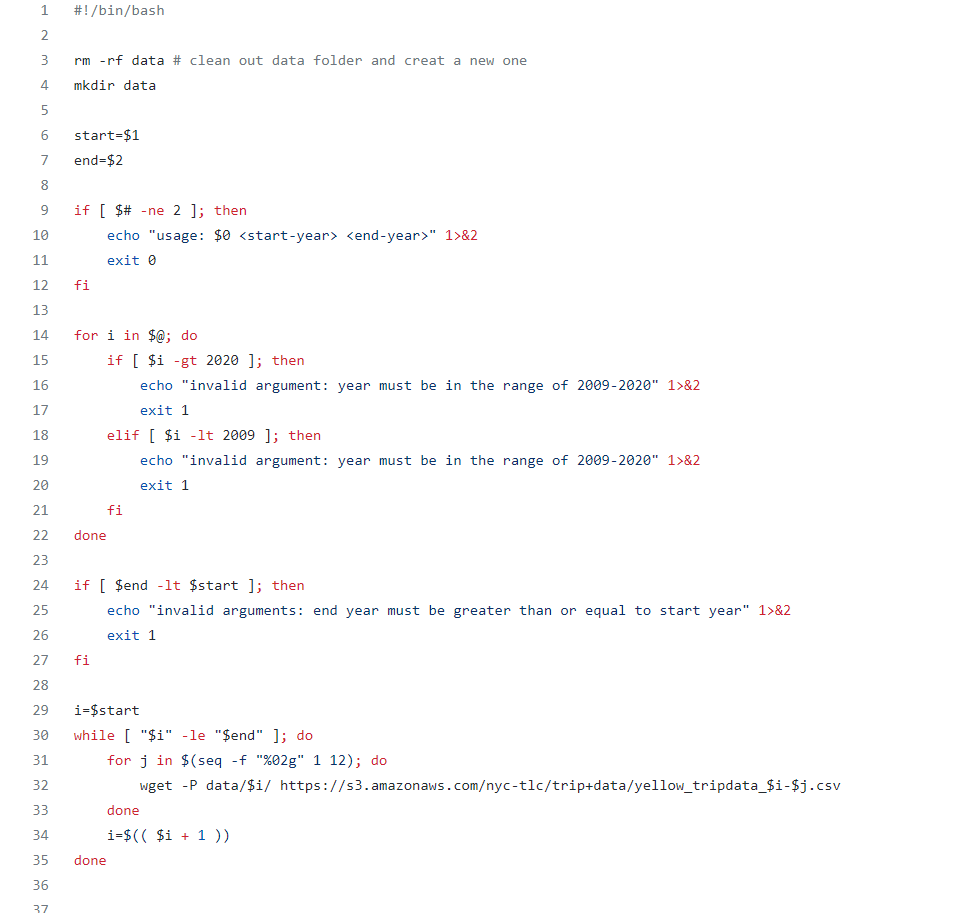
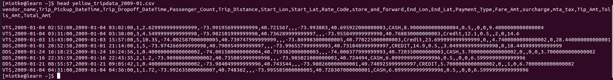
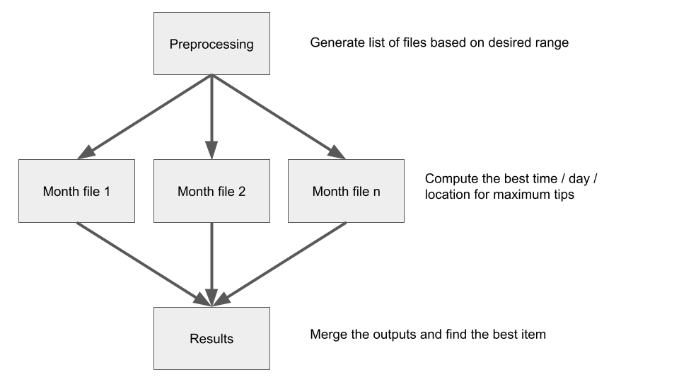

```{r setup, include=FALSE}
knitr::opts_chunk$set(echo = TRUE)
```

## Big Question

**Are there areas in New York where cab riders are more likely to tip larger percentages? Does this vary by time of day, season, etc.?**



## Data

Data from Kaggle: Yellow New York Taxi Dataset


Contains data relating to each New York yellow taxi trip, broken up into different csv files for each month.

Data also available at https://www1.nyc.gov/site/tlc/about/tlc-trip-record-data.page.

## Reading the Data

**Use a shell script with a wget command line**



#### Example of the data:



## Variables of Interest

#### Pickup Time

This variable gives a datetime object when a taxi picked up a person or group of people

#### Drop off Time

This variable gives a datetime object when a taxi drops off a person or group of people at their destination

#### Number of Passengers

This is an integer variable telling how many passengers were in the cab for the trip

#### Trip Starting Latitude & Longitude

These two variables work in tandem to locate the place where a person or group of person were picked up by a taxi cab

#### Trip Ending Latitude and Longitude

These two variables work in tandem to locate the place where a person or group of people were dropped off by a taxi cab

#### Fare Amount

This variable measures how much money the cab ride cost

#### Tip Amount

This variable measures how much the passengers tipped the cab driver

## Statistical Methods


## Computational Steps

Use the CHTC to perform analysis on each csv file in parallel. This makes sense because each of the files is ~ 2 GB. Each file will be given an extra variable determining which area of the city a person or group of people were picked up. By adding this variable, it will allow us to find the average tipping percentage of passengers from this area. Once each area is given a average tipping percentage, we will be able to compare them. We can do this for each file, meaning we will know the highest areas for each month. We can then compare the months to see if there are trends. After we know the general trends, we could check to see if there are trends within a day, looking at areas with the highest tipping percentage by hour.



## Link to Github repository

https://github.com/robiscuits/taxies
