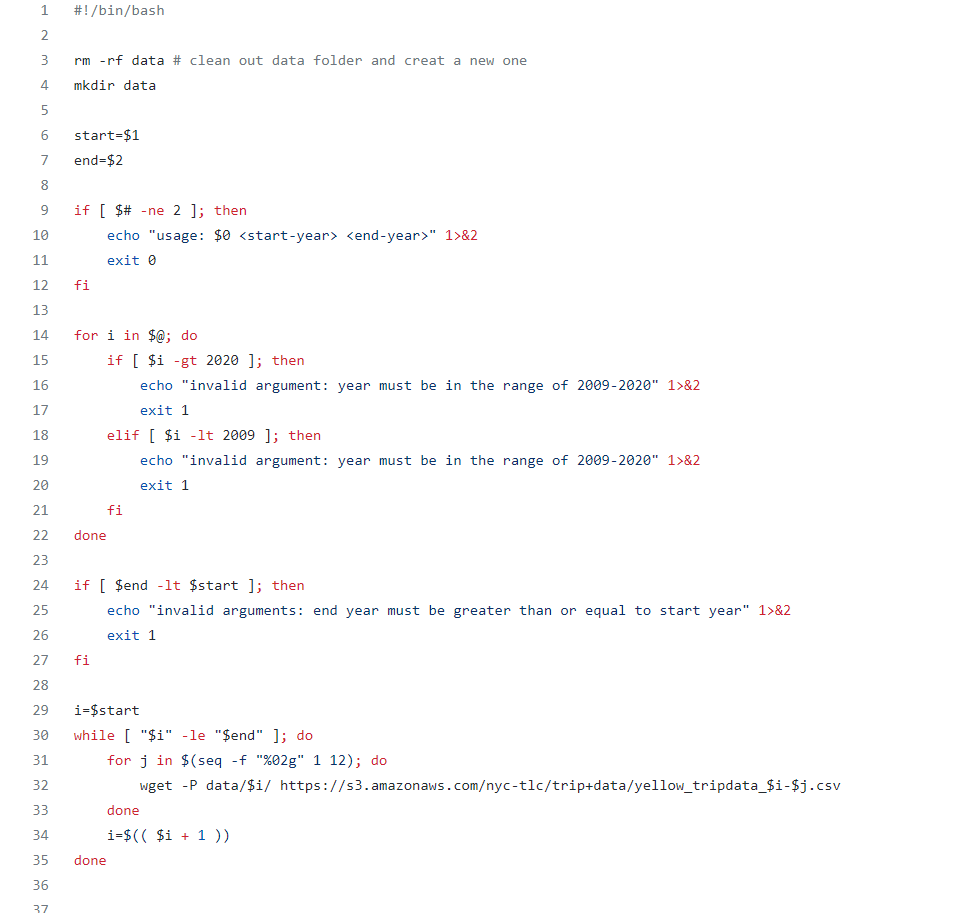
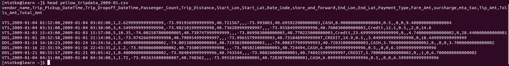

```{r setup, include=FALSE}
knitr::opts_chunk$set(echo = TRUE)
```

## Data

Data from Kaggle: Yellow New York Taxi Dataset


Contains data relating to each New York yellow taxi trip, broken up into different csv files for each month.

Data also available at https://www1.nyc.gov/site/tlc/about/tlc-trip-record-data.page.

## Reading the Data

**Use a shell script with a wget command line**



#### Example of the data:



## Variables of Interest

#### Pickup Time, Drop off Time, Number of Passengers, Trip Distance, Trip Starting Latitude & Longitude, Trip Ending Latitude and Longitude, Fare Amount, Tip Amount

## Statistical Methods

Unsure

## Computational Steps

Use the CHTC to perform ... on each csv file in parallel. This makes sense because each of the files is ~ 2 GB.
