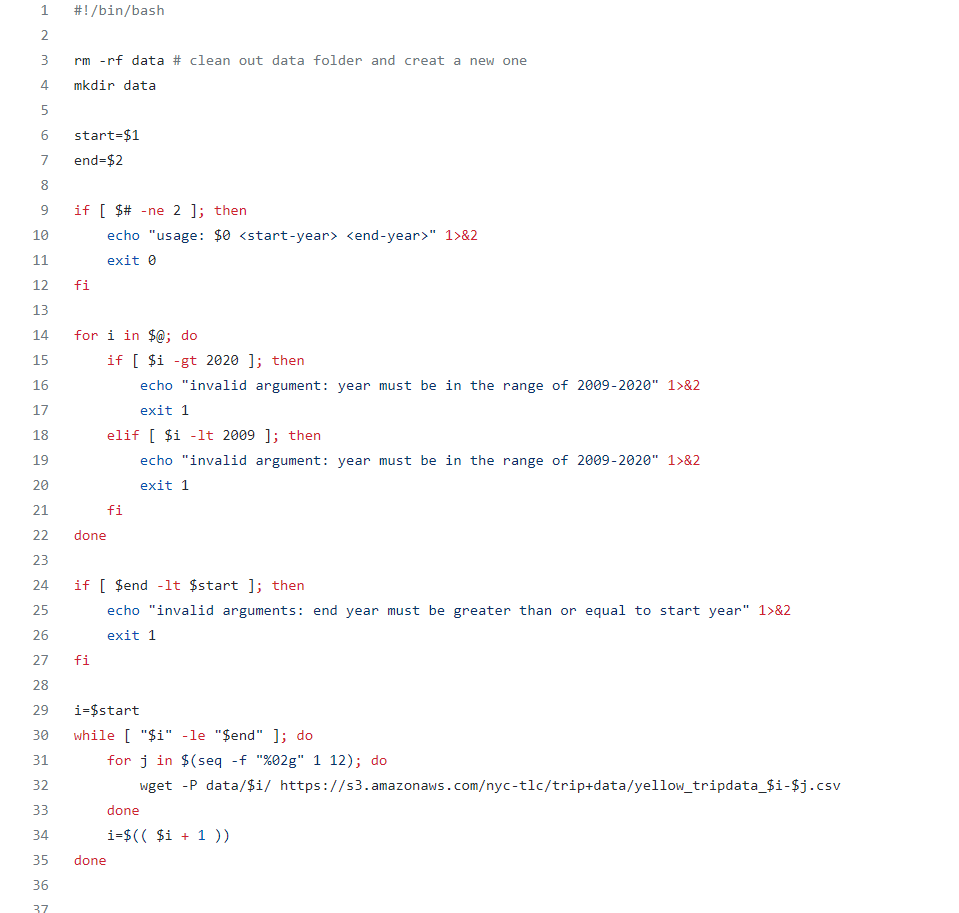
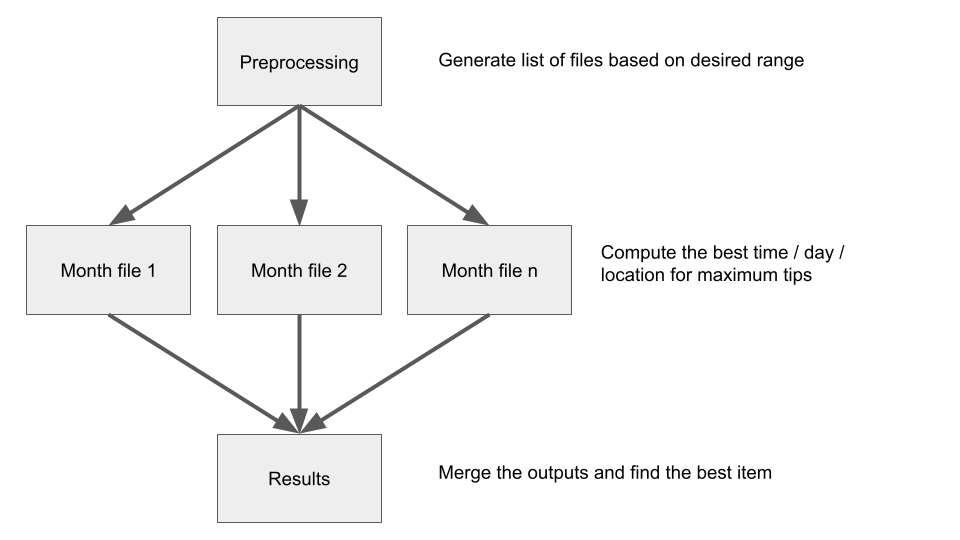

Project Proposal
================
Team Bravo
4/14/2022

## Big Question

**Are there areas in New York where cab riders are more likely to tip
larger percentages? Does this vary by time of day, season, etc.?**

## Data

Data from Kaggle: Yellow New York Taxi Dataset

Contains data relating to each New York yellow taxi trip, broken up into
different csv files for each month.

Data also available at
<https://www1.nyc.gov/site/tlc/about/tlc-trip-record-data.page>.

## Reading the Data

**Use a shell script with a wget command line**

#### Example of the data:

## Variables of Interest

#### Pickup Time

This variable gives a datetime object when a taxi picked up a person or
group of people

#### Drop off Time

This variable gives a datetime object when a taxi drops off a person or
group of people at their destination

#### Number of Passengers

This is an integer variable telling how many passengers were in the cab
for the trip

#### Trip Starting Latitude & Longitude

These two variables work in tandem to locate the place where a person or
group of person were picked up by a taxi cab

#### Trip Ending Latitude and Longitude

These two variables work in tandem to locate the place where a person or
group of people were dropped off by a taxi cab

#### Fare Amount

This variable measures how much money the cab ride cost

#### Tip Amount

This variable measures how much the passengers tipped the cab driver

## Statistical Methods

We are going to try and find a correlation between starting point (by
utilizing latitude and longitude) and tipping percentage.

## Computational Steps

Each file will be given an extra variable determining which area of the
city a person or group of people were picked up. By adding this
variable, it will allow us to find the average tipping percentage of
passengers from this area. This can be done to all of the csv files in
parallel using the CHTC. It makes sense to use the CHTC since each csv
file is \~2 GB. Once each area is given an average tipping percentage,
we will be able to compare them. By doing this for each file, we will
have access to the areas with the highest tipping percentage for each
month. We can then compare the months to see if there are trends. After
we know the general trends, we could check to see if there are trends
within a day, looking at areas with the highest tipping percentage by
hour.

## Link to Github repository

<https://github.com/robiscuits/taxies>
