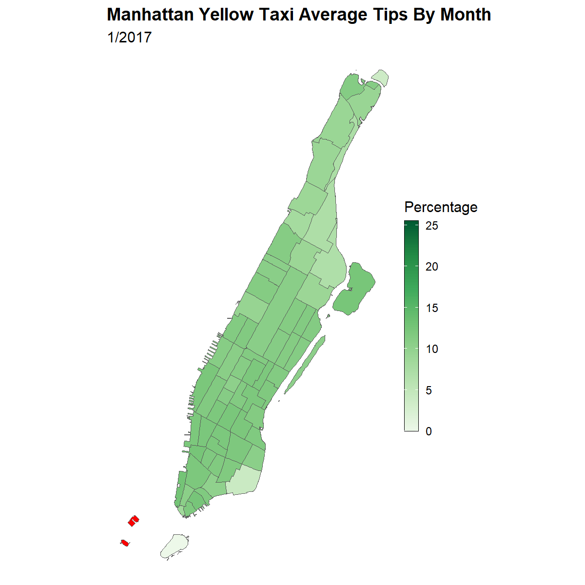
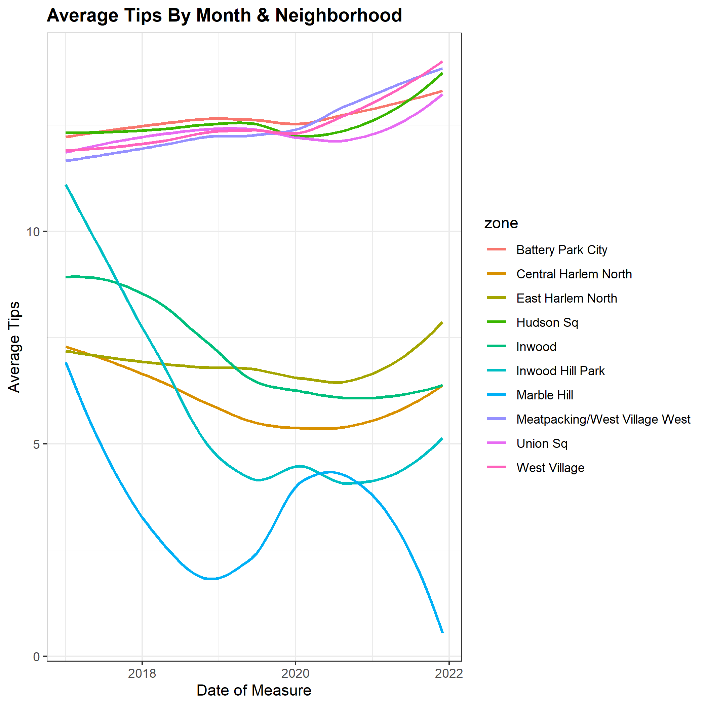
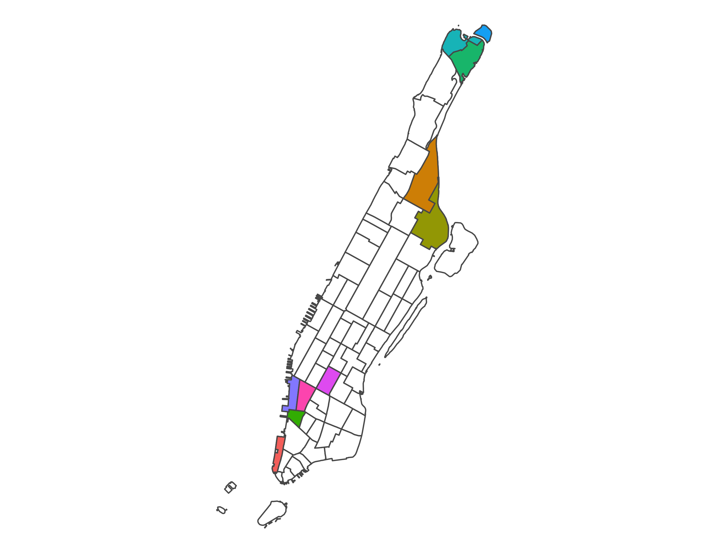
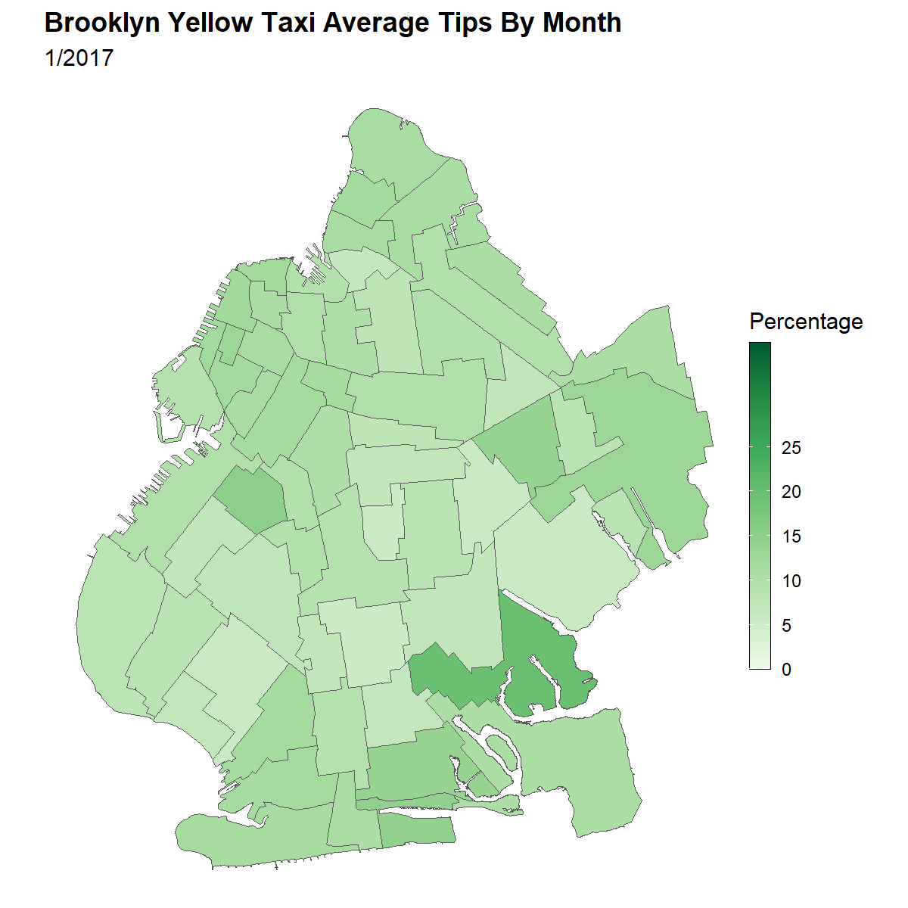
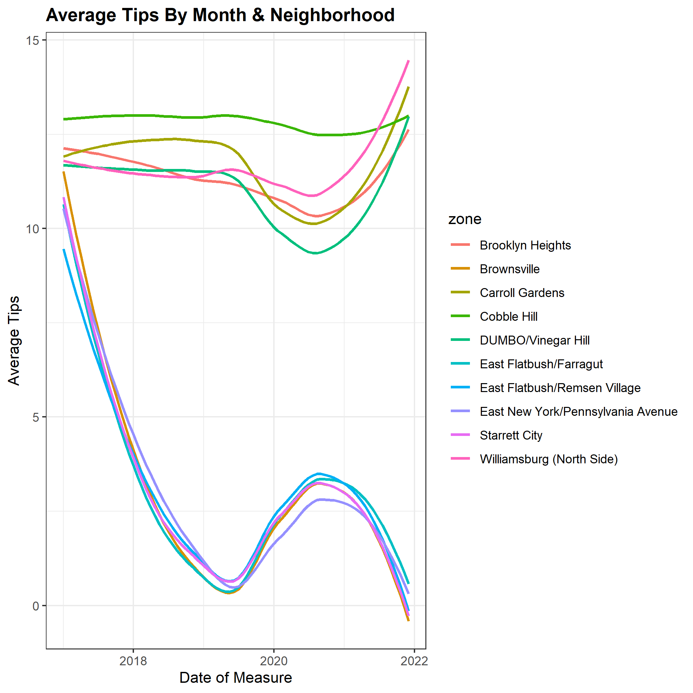
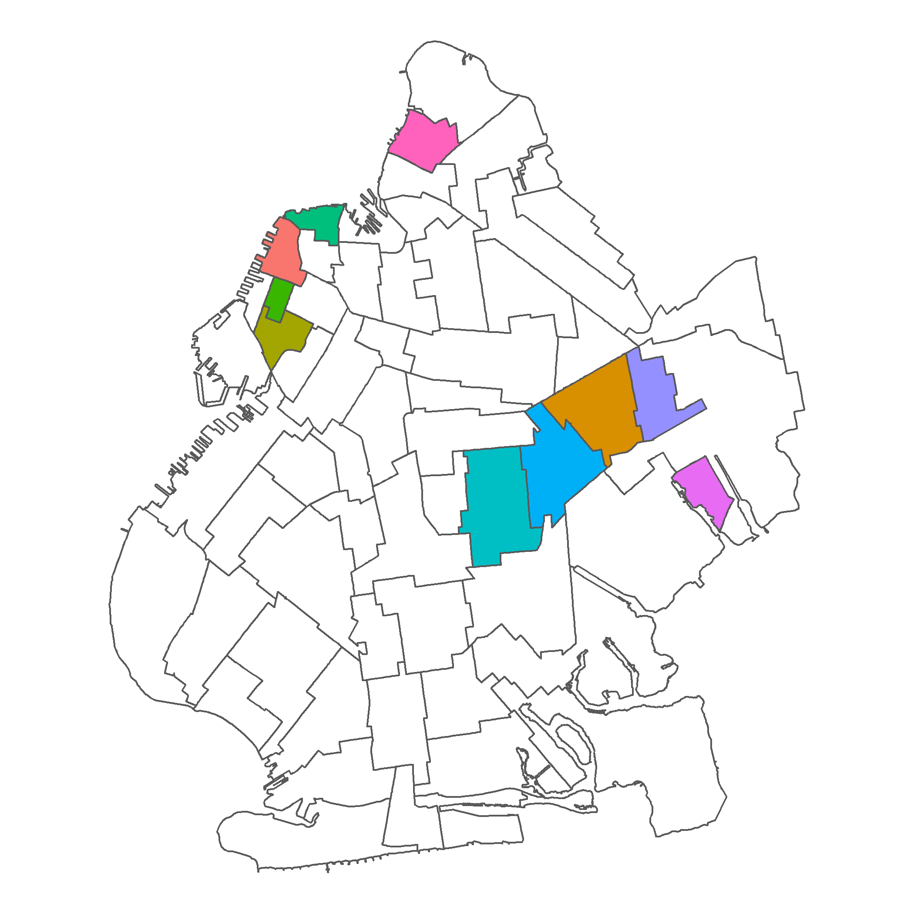

```{r setup, include=FALSE}
knitr::opts_chunk$set(echo = TRUE)
```

## Introduction

The question we wish to answer is **whether different New York City neighborhoods differ significantly from each other in tipping percentage**. To answer this question, we computed and compared the average tipping percentages on different pick-up locations and see how the tip amount varies by time. Our dataset exists on Kaggle as the New York Yellow Taxi dataset, but we found additional months of data on a separate website. The data contains a file for each month with pick-up and drop-off times, pick-up and drop-off locations, fare amount and tip amount. Our shell script downloads the data separately by month, then a .sub file cleans and processes the data in parallel on the CHTC, with each node given a month of data, and finished by writing an .Rmd file to finish our analysis and create our visualizations. We ran two analyses for the boroughs we focused our efforts on: Manhattan and Brooklyn. We found little variation over time, but we did find evidence for differences in tipping percentage density between neighborhoods within each borough.

## Data Description / Manipulation

The dataset contains information on every taxi trip in New York City between 2005 and 2021. Each month of data is contained in a csv file. Initially, we had issues downloading all of the data as one big file, so we used a shell script to download each file separately. For our spatial analysis, our computation was initially going to rely on the exact latitude and longitude of a trip’s pick-up point. Through a bit of data observation, we found that after 2017 latitude and longitude were unavailable. Instead, these later data files contained a `LocationID` variable which categorized the location into different neighborhoods. Due to latitude and longitude shape files being difficult to work with, we used data from years after 2017 containing the ID value to simplify our computation. This is how we were able to graph our tipping and frequency values on a map.

## Manhattan

## Visual Analysis

Our analysis consisted of a spatial density analysis over time. We graphed tipping percentage concentrations within neighborhoods of Manhattan. When the green is darker, the average tipping percentage in that neighborhood is higher (missing values are red).
<br/><br/>

```{r, echo=FALSE, out.width="70%", fig.cap="\\textcolor{red}{Higher tipping percentages on wealtier regions}", fig.align = 'center'}

```

<br/><br/>
Although the animation above shows little variability over time, we can see a slightly darker green in southern Manhattan neighborhoods. Battery Park City, Hudson Square, West Village and Union Square boast the highest tipping percentages averaged over our time frame. These neighborhoods are all located near the Financial District. Harlem and other northern Manhattan neighborhoods boast lower tipping percentages. These neighborhoods are less attractive to wealthier riders, which we posit to be extremely influential in our analysis. We also see a slight increase in tipping percentage over time in the animation.

## Statistical Analysis

Next, we assessed whether neighborhoods had an empirically verifiable effect on tipping percentage, isolated at each specific month of data. Thus, a Repeated Measures ANOVA was run on average tips by date and location. This methodology was used in order to determine how much variance in tipping could be explained by pickup neighborhood while controlling for the temporal dimension of our data. The effect of neighborhood on average tips was highly significant (p=6.05e-17) within each date point (months), giving us ample evidence to conclude that there is some dependency between location and tipping. The plots below continue to show how wealthier Manhattan neighborhoods boast higher tipping percentages than poorer neighborhoods in northern Manhattan.


<br/><br/>

```{r, echo=FALSE, out.width="70%", fig.cap="\\textcolor{red}{Higher tipping percentages on wealtier regions}", fig.show="hold", out.width="50%"}


```

<br/><br/>

## Brooklyn

Our visual and statistical analyses for Brooklyn neighborhood tipping differences followed a very similar pattern to our analysis of Manhattan.

<br/><br/>

```{r, echo=FALSE, out.width="70%", fig.cap="\\textcolor{red}{Higher tipping percentages on wealtier regions}", fig.align = 'center'}

```

<br/><br/>

<br/><br/>

```{r, echo=FALSE, out.width="70%", fig.cap="\\textcolor{red}{Higher tipping percentages on wealtier regions}", fig.show="hold", out.width="50%"}


```

<br/><br/>

The animation shows more variability over time than the Manhattan animation. This could be due to lower populations, and lower cab ride frequency, within this borough. However, we do see a similar density trend. The wealthier areas, like Brooklyn Heights, generally tip higher percentages. The statistical analysis for this borough returned similar results to that of the Manhattan analysis. The result of another RMANOVA was highly significant (p=9.07e-40), giving evidence that neighborhood and tipping percentage are not independent of each other.

## Conclusion

We concluded that tipping is strongly influenced by social expectations and disposable income; riders in richer neighborhoods are expected to and able to consistently tip better than those in less affluent neighborhoods. One point of interest depicted by the maps is the invariability of tipping percentages within neighborhoods over time. This is further evidence for our hypothesis. Finally, if this information were presented to a client, it could have adverse social consequences for passengers in the “lower-tipping” neighborhoods. Knowing tips are scarce, taxies may direct their efforts away from these neighborhoods to pursue higher tips.

